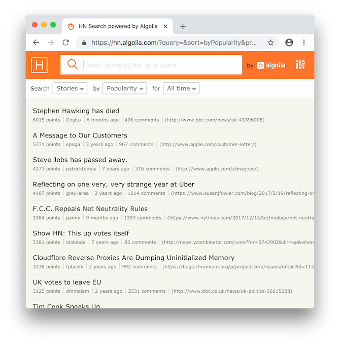

## Hacker News Search

I Hope you have heard about Hacker News, yes that's what we are building today. There’s the regular [Hacker News site](https://news.ycombinator.com/) and there is [Algolia HN Search](https://hn.algolia.com/) which is a fun project build on open source api's.



What is that you need to do ? Let's follow the list before we know about the source api's.

1. Write some pretty basic Html/Css for your Hacker news (Refer the image above or original hacker rank).
2. You will be listing all top stories* by default
3. Have a dropdown to switch between top stories* and best stories*.
4. Look and pay attention to detail for the story object. Don't miss anything such as title, score, date posted (manipulate to days ago), url, total comments, and posted by and also show the total stories (maxitems).

Sample story object

```
{
  "by" : "dhouston",
  "descendants" : 71,
  "id" : 8863,
  "kids" : [ 8952, 9224, 8917, 8884, 8887, 8943, 8869, 8958, 9005, 9671, 8940, 9067, 8908, 9055, 8865, 8881, 8872, 8873, 8955, 10403, 8903, 8928, 9125, 8998, 8901, 8902, 8907, 8894, 8878, 8870, 8980, 8934, 8876 ],
  "score" : 111,
  "time" : 1175714200,
  "title" : "My YC app: Dropbox - Throw away your USB drive",
  "type" : "story",
  "url" : "http://www.getdropbox.com/u/2/screencast.html"
}
```

5. So once all the stories are rendered, let's also build story detail page when user clicks on story to get detail page. Same write up some sample html referring to [Algolia HN Search](https://hn.algolia.com/)
6. While rendering the story itself on the detail page, also render all the comments (kids may not have nested comments you can render all at the same level).

#### API Sources you will be using for development.
Algolia HN Search has a REST API, and Hacker News exposes stories through a [Firebase API](https://github.com/HackerNews/API)

#### What needs to be done mandatorily.

So all of this has to be achieved using React/Angular as your expertise. Below are the major mark points.

```
1. Achieve routing.
2. Rendering stories.
3. Rendering story details.
4. Navigating between story and details.
5. Use es6 javascript code standards.
6. Minimal code.
7. Contextual variable declaration/usage.
8. Contribute frequently to your public repository on github so that we can understand the development journey.
```
#### What more can be achieved (Bonus).
Want to impress us? Grab bonus marks by doing these.
```
1. Achieve Login by hardcoding credentials in a json file.
2. Achieve the nearest design possible to Hacker News.
3. By Submitting this before the date mentioned.
```

Happy Coding,
[Reckonsys](reckonsys.com)
